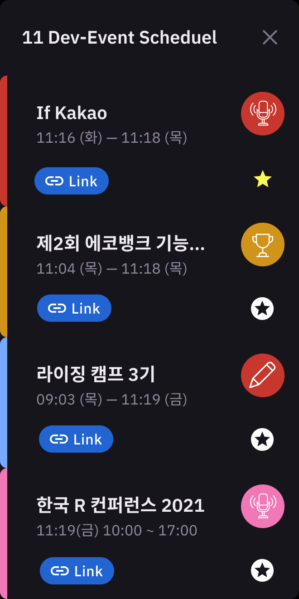
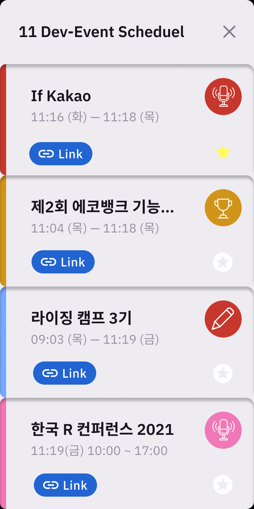

# Dev-Event-Chrome-Extention

> 현재 해당 레포지토리는 개발 진행중입니다!
> 🎉🎈 Dev Event를 크롬 확장앱에서 만나요

## Design

- 디자인은 `블랙테마`, `화이트 테마`로 제작 예정입니다.
- Title의 길이가 길면 잘리는 부분이 있어서 2초간 hover를 하면 카드를 키우는 작업 진행중

## 개발환경

> Container-Presenter

- `React Version 17.0.1`
- `Jssoup` (크롤링)
- `ESlint airbnb`
- `prettier`

## 체크리스트

- [x] Extension Boilerplate
- [x] UI제작
- [x] Jssoup를 통한 Dev-Event 크롤링
- [x] Dev-Event Render
- [ ] UI 수정
- [ ] 즐겨찾기,Chrome Storage.sync를 통해 사용자 동기화

- [ ] NewTab을 눌렀을때 DevEventSite로 이동(?)
